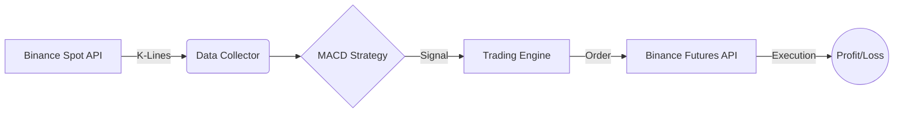

# 🤖 BinanceSimu: MACD Strategy Trading Console
### 币安模拟交易 - MACD 策略控制台

[](https://www.python.org/)
[](https://flask.palletsprojects.com/)
[](https://binance-docs.github.io/apidocs/)
[](LICENSE)

---

## 📖 Introduction / 简介

**BinanceSimu** is a sophisticated cryptocurrency trading simulator and strategy execution platform. It features a unique architecture that **monitors Spot market signals** while **executing trades in the Perpetual Futures market**. The system uses a high-frequency MACD strategy (5, 10, 3) to capture market momentum.

**BinanceSimu** 是一个高级加密货币交易模拟器和策略执行平台。其核心特性在于独特的架构：**监控现货市场信号**，同时在**永续合约市场执行交易**。系统采用高频 MACD 策略 (5, 10, 3) 来捕捉市场动量。

---

## ✨ Key Features / 主要功能

- **Hybrid Architecture**: Monitor Spot (low noise) and trade Futures (leverage).
- **Real-time Dashboard**: Live price tracking, equity curves, and MACD signal visualization.
- **Automated Strategy**: Fully automated MACD Golden/Dead cross execution.
- **Manual Control**: One-click manual open/close for emergency intervention.
- **Risk Management**: Configurable leverage (default 10x) and isolated margin mode.

- **混合架构**：监控现货（低噪音信号）并交易合约（利用杠杆）。
- **实时仪表盘**：实时价格追踪、资金曲线和 MACD 信号可视化。
- **自动化策略**：全自动 MACD 金叉/死叉执行。
- **手动控制**：一键手动开/平仓，用于紧急干预。
- **风险管理**：可配置杠杆（默认 10x）和逐仓保证金模式。

---

## 🏗 Architecture / 系统架构



---

## 🚀 Deployment / 部署流程

### 1. Prerequisites / 环境准备
- Python 3.8+
- [Conda](https://docs.conda.io/en/latest/) (Recommended)

### 2. Installation / 安装步骤
```bash
# Clone the repository
git clone https://github.com/your-repo/BinanceSimu.git
cd BinanceSimu

# Create and activate environment
conda create -n binanceSimu python=3.11
conda activate binanceSimu

# Install dependencies
pip install -r requirements.txt
pip install binance-futures-connector
```

### 3. Configuration / 配置变量
Create a `.env` file in the root directory:
在根目录创建 `.env` 文件：

```dotenv
# Spot Testnet (for monitoring)
BINANCE_API_KEY=your_spot_key
BINANCE_API_SECRET=your_spot_secret
BINANCE_MODE=testnet

# Futures Testnet (for trading)
BINANCE_FUTURES_API_KEY=your_futures_key
BINANCE_FUTURES_API_SECRET=your_futures_secret
```

---

## 🔑 API Application / 申请 API

### Spot Testnet / 现货测试网
1. Visit [testnet.binance.vision](https://testnet.binance.vision/).
2. Log in with your GitHub account.
3. Generate "HMAC" API Key.

### Futures Testnet / 合约测试网
1. Visit [testnet.binancefuture.com](https://testnet.binancefuture.com/).
2. Register/Login to the futures testnet account.
3. Locate the "API Key" tab at the bottom and generate a new key.
4. **Note**: Spot and Futures testnet keys are **NOT** interchangeable.

---

## 🛠 Usage / 使用方法

1. **Start the Server**:
   ```bash
   python app.py
   ```
2. **Access Dashboard**:
   Open `http://localhost:5431` in your browser.
3. **Start Strategy**:
   Click the **"Start Strategy"** button to begin automated trading.

---

## 👤 Contact / 联系方式

**Author**: 江景哲 (JIANG JINGZHE)  
**Email**: [contact@jiangjingzhe.com](mailto:contact@jiangjingzhe.com)  
**Portfolio**: [BinanceSimu Project](https://github.com/your-username/BinanceSimu)

---

## 📄 License / 许可证
This project is licensed under the MIT License - see the [LICENSE](LICENSE) file for details.
本项目采用 MIT 许可证 - 详见 [LICENSE](LICENSE) 文件。
